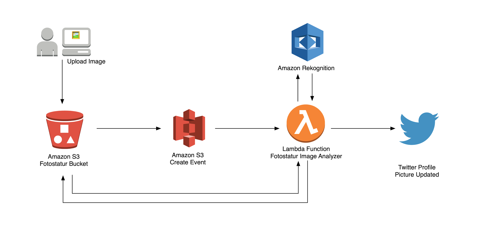

# Fotostatur
  
> Photostat - _noun_ a still picture taken with a camera [Source](https://www.thesaurus.com/browse/photostat?s=ts)
  
In this challenge, we'll build an image analyzer that will rate the image using different criteria of your choosing by running the image through most of the Amazon Rekognition features.

An image passing the required criteria is deemed worthy of a profile picture and subsequently update social media profiles.



## Helpful Links
[.NET AWS SDK Docs](https://docs.aws.amazon.com/sdkfornet/v3/apidocs)

# Pre-requisites
The following tools and accounts are required to complete these instructions.

* [AWS Account](https://aws.amazon.com/)
* [Install AWS CLI](https://aws.amazon.com/cli/)
* [Install .NET Core 2.1](https://www.microsoft.com/net/download)

# Tools, Infrastructure, and Code Setup

<details>
<summary>Setup LambdaSharpTool and Deploy Skeleton Code</summary>

1) Clone the Repo and go to the `Fotostatur` directory.

1) Install/update the λ# tool.

    ```bash
    dotnet tool install -g MindTouch.LambdaSharp.Tool --version 0.4.0.4
    ```
    
    -- Or if already installed, to update:
    
    ```bash
    dotnet tool update -g MindTouch.LambdaSharp.Tool
    ```

1) Once installed/updated, the λ# CLI needs to be configured/updated.

    ```bash
    dotnet lash config
    ```

1) Initialize/update deployment tier with the λ# runtime.
    ```bash
    dotnet lash init --tier Sandbox
    ```

1) From the root of the cloned repo, deploy the skeleton code. **NOTE: This is the command to deploy any future changes.**
    ```bash
    dotnet lash deploy Fotostatur --tier Sandbox
    ```

    > See [Setup LambdaSharp CLI & Runtime](https://github.com/LambdaSharp/LambdaSharpTool/tree/master/Runtime#setup-lambdasharp-cli--runtime) for detailed instructions and more info about the LambdaSharpTool.
    > Note: LambdaSharp Contributors need to unset the `LAMBDASHARP` environment variable if you want to use `dotnet lash`

1) Find the `FotostaturPhotoBucket` bucket name in the CloudFormation outputs:

    > Hint: From the AWS console navigate to `Cloudformation` > `Sandbox-Fotostatur` > `Resources`

1) Test deployment by choosing an image to upload.

    In the command below replace `SOURCE_IMAGE.JPG` and `FOTO_STATUR_PHOTOBUCKET` for their respective names.
    
    From the directory where the image resides, run the command:
    
    ```bash
    aws s3 cp SOURCE_IMAGE.JPG s3://FOTO_STATUR_PHOTOBUCKET/images/SOURCE_IMAGE.JPG
    ```
    
    > Note: It is being uploaded to an `images` path.
 
1) Check the lambda function's CloudWatch logs to see if it was invoked with the S3 Upload. In the logs it should show the final score of 0.

1) From the directory where the image resides delete the image from S3.
    ```bash
    rm s3://FOTO_STATUR_PHOTOBUCKET/images/SOURCE_IMAGE.JPG
    ```
    
    > Note: It is being deleted from an `images` path.
    
> Note: While you could use the AWS console to upload an image, it's highly recommended for speedier development to use the AWS CLI to upload and remove images from S3.

</details>
 
# Understanding the Challenge Setup

<details>
<summary>Confidence score info/background and helper functions</summary>

### Confidence Scores

[About Confidence scores](https://aws.amazon.com/rekognition/faqs/#Object_and_Scene_Detection)
```
A confidence score is a number between 0 and 100 that indicates the probability that a given prediction is correct.
```

Confidence scores are provided in most responses from Rekognition.

### Helper Function

A helper function to add totals is provided. Use the following code snippet when needed:

```
AddTotals("criteria label", (float) 99.1234);
```

Where `criteria label` is any string to identify the criteria, and the `float` which is the confidence score.

</details>

# Level 1

<details>
<summary>Detect Objects and Scenes</summary>

In `Fotostatur.ImageAnalyzer/Functions.cs` edit the `DetectLabels` and `ScoreLabels` methods.

[DetectLabelsAsync Method](https://docs.aws.amazon.com/sdkfornet/v3/apidocs/items/Rekognition/MRekognitionDetectLabelsAsyncDetectLabelsRequestCancellationToken.html)

1) Detect the labels from the image uploaded.
1) Score the results from detect labels using the `AddTotals` helper function to keep a running total.

Test your code by using the CLI commands above to deploy, upload and remove images from S3.

Use CloudWatch to see the final score change based on criteria added.    

</details>

# Level 2

<details>
<summary>Detect Text</summary>

In `Fotostatur.ImageAnalyzer/Functions.cs` edit the `DetectText` and `ScoreText` methods.

[DetectTextAsync Method](https://docs.aws.amazon.com/sdkfornet/v3/apidocs/items/Rekognition/MRekognitionDetectTextAsyncDetectTextRequestCancellationToken.html)

1) Detect any text from the image uploaded.
1) Score the results from detect text using the `AddTotals` helper function to keep a running total.

Test your code by using the CLI commands above to deploy, upload and remove images from S3.

Use CloudWatch to see the final score change based on criteria added.

</details>

# Level 3

<details>
<summary>Compare Faces</summary>

In `Fotostatur.ImageAnalyzer/Functions.cs` edit the `CompareFaces` and `ScoreCompare` methods.

[CompareFacesAsync Method](https://docs.aws.amazon.com/sdkfornet/v3/apidocs/items/Rekognition/MRekognitionCompareFacesAsyncCompareFacesRequestCancellationToken.html)

1) Add a "headshot" of someone to the `Fotostatur/headshots` directory.
1) In `Fotostatur/Module.yml`, find `HeadshotFileName` and replace the `TODO` with the filename (include extension) of the headshot.
    > Note: These variables can be accessed from: `_headshotFileName`, `_comparingImageBucket`, and `_comparingImageKey`. See `InitializeAsync` in `Fotostatur.ImageAnalyzer/Functions.cs`.
1) Compare the headshot and the image uploaded.
1) Score the results from comparison using the `AddTotals` helper function to keep a running total.

Test your code by using the CLI commands above to deploy, upload and remove images from S3.

Use CloudWatch to see the final score change based on criteria added.

</details>

# Level 4

<details>
<summary>Detect Faces</summary>

In `Fotostatur.ImageAnalyzer/Functions.cs` edit the `DetectFaces` and `ScoreFaces` methods.

[DetectFacesAsync Method](https://docs.aws.amazon.com/sdkfornet/v3/apidocs/items/Rekognition/MRekognitionDetectFacesAsyncDetectFacesRequestCancellationToken.html)
[DetectFacesAPI](https://docs.aws.amazon.com/rekognition/latest/dg/API_DetectFaces.html)

1) Detect faces from the image uploaded.
1) See `ScoreFaces` for a commented list of objects to generate criteria with. Use at least one.
1) Score the results from generated criteria using the `AddTotals` helper function to keep a running total.

Test your code by using the CLI commands above to deploy, upload and remove images from S3.

Use CloudWatch to see the final score change based on criteria added.

</details>

# BOSS

<details>
<summary>Upload Image to Twitter Profile</summary>

To obtain Twitter keys, use the steps provided at the presentation. To create tokens you must have a Twitter account and create an app on the [Twitter Developer Site](https://developer.twitter.com/en/apps).

1) Encrypt the Twitter keys `TwitterConsumerKey`, `TwitterConsumerSecret`, `TwitterAccessToken`, `TwitterAccessSecret`.

    ```bash
    lash encrypt SECRET
    ```

    You will need to uncomment the `TwitterConsumerKey`, `TwitterConsumerSecret`, `TwitterAccessToken`, `TwitterAccessSecret` in `Fotostatur/Module.yml` and add each encrypted value to their respective location. 

1) In `Fotostatur.ImageAnalyzer/Functions.cs` edit the `DownloadS3Image` method and uncomment `await DownloadS3Image();` in method `ProcessMessageAsync`.
    
    `DownloadS3Image` should download and save the image locally from S3.
    
    > See [TransferUtility](https://docs.aws.amazon.com/sdkfornet/v3/apidocs/items/S3/TTransferUtility.html) for easy download from S3 to local file.
    
1) In `Fotostatur.ImageAnalyzer/Functions.cs` edit the `ResizeImage` method and uncomment `ResizeImage();` in method `ProcessMessageAsync`.

    `ResizeImage` should resize the image downloaded and save locally to another location.
    
    > See [ImageSharp Resize Example](https://github.com/SixLabors/ImageSharp#api)
    
1) In `Fotostatur.ImageAnalyzer/Functions.cs` edit the `TwitterUpload` method to change the `LOCAL FILE PATH` and uncomment `TwitterUpload();` in method `ProcessMessageAsync`.

1) In `Fotostatur.ImageAnalyzer/Functions.cs` edit the `_criteriaThreshold` from `50` to desired number in method `InitializeAsync`.

1) (Optional) In `Fotostatur.ImageAnalyzer/Functions.cs` edit the `UploadImage` method and uncomment `UploadImage();` in method `ProcessMessageAsync`.

    > See [TransferUtility](https://docs.aws.amazon.com/sdkfornet/v3/apidocs/items/S3/TTransferUtility.html) for easy upload to S3 from local file.

Test your code by using the CLI commands above to deploy, upload and remove images from S3.

Use CloudWatch to see the final score change based on criteria added.

Check Twitter for the new profile picture.

</details>

# Teardown

<details>
<summary>Remove Fotostatur and Lambdasharp installation</summary>

### Removing Fotostatur

1) Empty the S3 bucket for `Fotostatur` (the one uploading images to).
1) On the CloudFormation page in the AWS console, select the stack named `{tier}-Fotostatur`, click `Actions` and then `Delete Stack`.

### Removing LambdaSharp Tier Installation

1) On the S3 bucket page in the AWS console, empty the bucket that begins with `{tier}-lambdasharp-s3package`.
1) Delete the stack `{tier}-LambdaSharp`

### Removing the LambdaSharpTool Installation

1) On the S3 bucket page in the AWS console, empty the bucket that begins with `lambdasharptool-default-deploymentbucket`.
1) Remove the cli profile stack named `LambdaSharpTool-{cli-profile}`.

</details>